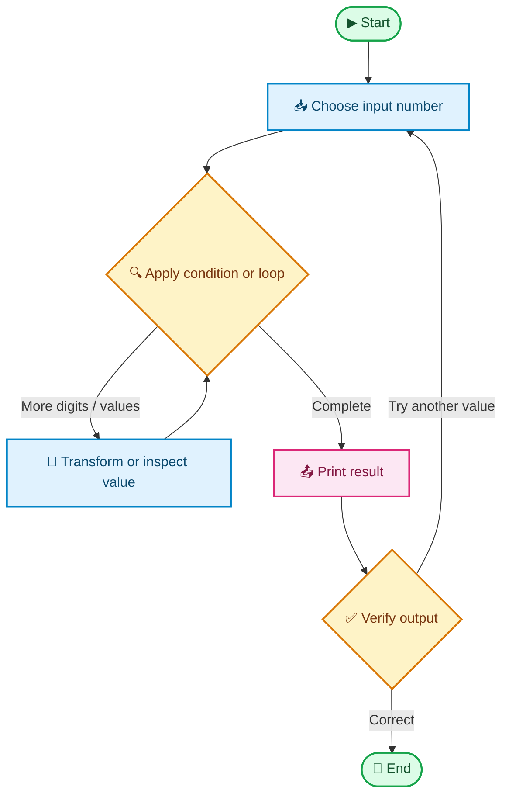

# 2026 TypeScript Revision

<div align="center">

**A colorful, hands-on path from TypeScript fundamentals to problem-solving**

[](https://www.typescriptlang.org/)
[](https://nodejs.org/)
[](#exercise-catalogue)
[](#repository-status)

<br />

`🧱 Foundations`  ·  `🧠 Logic`  ·  `🔁 Loops`  ·  `➗ Mathematics`

</div>

> **Revision goal:** build strong TypeScript fundamentals by solving one focused problem at a time.

A structured collection of **29 standalone TypeScript exercises** for revising programming fundamentals, data types, conditional statements, loops, and basic mathematical problem-solving.

The exercises are intentionally small and focused. Each file demonstrates one concept and can be compiled or executed independently.

## 🧭 Quick navigation

| Section | What you will find |
|---|---|
| [📚 Learning objectives](#-learning-objectives) | Skills practiced throughout the revision |
| [🗂️ Project structure](#️-project-structure) | Folder map and exercise distribution |
| [🚀 Getting started](#-getting-started) | Install, run, and type-check commands |
| [🧩 Exercise catalogue](#-exercise-catalogue) | Detailed notes for all 29 exercises |
| [🗺️ Learning flows](#️-learning-flows) | Visual progression and decision flows |
| [✅ Suggested revision order](#-suggested-revision-order) | A practical study sequence |

## 📚 Learning objectives

By completing this revision project, you practice:

- TypeScript variable declarations and primitive data types
- Type annotations, union types, `any`, `null`, and `undefined`
- Console output and string concatenation
- Explicit conversion from strings to numbers
- Boolean expressions and comparison operators
- `if`, `else if`, `else`, and `switch` statements
- `while`, `for`, and `do...while` loops
- `break` and `continue`
- Number reversal, factorial, Fibonacci series, and digit counting
- Prime numbers, Armstrong numbers, perfect numbers, GCD, and LCM
- Leap-year and power-of-number calculations

## 🗂️ Project structure

```text
foundation/
├── Concept001_Basic/
├── Concept002_DataTypes/
├── Concept003_Conditions/
├── Concept004_Loops/
└── Concepts005_ProblemsMaths/
```

| Directory | Focus | Exercises |
|---|---|---:|
| `Concept001_Basic` | Basic TypeScript and variable declarations | 2 |
| `Concept002_DataTypes` | Primitive types, unions, and conversion | 3 |
| `Concept003_Conditions` | Boolean logic and decision-making | 6 |
| `Concept004_Loops` | Iteration, loop control, and number algorithms | 16 |
| `Concepts005_ProblemsMaths` | Mathematical problem-solving | 2 |
| **Total** |  | **29** |

## 🚀 Getting started

### Prerequisites

- Node.js
- npm
- TypeScript
- `ts-node`

The project dependencies are defined in [`package.json`](./package.json).

### Install dependencies

```bash
npm install
```

### Run an exercise

Each file is an independent script. For example:

```bash
npx ts-node foundation/Concept004_Loops/Test015-PerfectNumber.ts
```

If the local `ts-node` launcher does not have executable permissions in your environment, run it through Node directly:

```bash
node node_modules/ts-node/dist/bin.js foundation/Concept004_Loops/Test015-PerfectNumber.ts
```

### Type-check an exercise without generating JavaScript

```bash
npx tsc --noEmit --target ES2020 --module commonjs \
  foundation/Concept004_Loops/Test015-PerfectNumber.ts
```

Because the exercises are standalone scripts with repeated variable names, type-check them individually rather than compiling every file as one shared program.

## 🧩 Exercise catalogue

### 🧱 1. Basic TypeScript

#### `Test001-ConsoleOutput.ts`

**Concept:** Basic program execution and `console.log()`.

Prints a message to the console. This is the first exercise for verifying that the TypeScript runtime and execution environment are working.

#### `Test002-VariableDeclaration.ts`

**Concept:** Variable declarations and initialization.

Introduces `var`, `let`, and variable initialization. The comments demonstrate the difference between reading an undeclared variable and declaring a variable without assigning a value.

### 🧬 2. Data types

#### `Test001-NumberAddition.ts`

**Concept:** Number type and arithmetic operators.

Declares two numeric variables with TypeScript annotations and prints their sum.

#### `Test002-TypeScriptDataTypes.ts`

**Concept:** TypeScript primitive and special types.

Demonstrates:

- `number`
- `string`
- `boolean`
- `null`
- `undefined` through an uninitialized variable
- `any`
- Union types such as `number | string`
- Difference between `let` and `const`

#### `Test003-StringNumberConversion.ts`

**Concept:** String concatenation and explicit numeric conversion.

Shows that `+` concatenates a string and a number, while subtraction, multiplication, and division require explicit conversion for type-safe TypeScript code using `Number()`.

### 🔀 3. Conditions

#### `Test001-CharacterCaseCheck.ts`

**Concept:** Regular expressions and boolean conditions.

Checks whether characters are uppercase or lowercase using regular expressions and prints the resulting boolean values.

#### `Test002-MultipleOfTen.ts`

**Concept:** Modulus operator and divisibility.

Uses the remainder operator (`%`) to check whether 10 is divisible by a given value.

#### `Test003-TeenagerCheck.ts`

**Concept:** Compound conditions with logical AND.

Checks whether an age falls within the teenager range using `&&` and comparison operators.

#### `Test004-PositiveEvenCheck.ts`

**Concept:** Combining sign and parity checks.

Uses modulus and comparison operators to determine whether a value is positive and even.

#### `Test005-UppercaseVowelCheck.ts`

**Concept:** Multiple OR conditions.

Checks whether a character is an uppercase vowel using `||`. This exercise also introduces the idea of replacing repeated comparisons with an `includes()` lookup.

#### `Test006-BrowserSelection.ts`

**Concept:** `switch` statements.

Selects a browser-related message based on a string value and uses `case`, `break`, and `default` branches.

### 🔁 4. Loops and iteration

#### `Test001-SumOneToTen.ts`

**Concept:** `while` loop and accumulator pattern.

Adds the numbers from 0 through 10 using a counter and a running sum.

#### `Test002-Factorial.ts`

**Concept:** Repeated multiplication with a `while` loop.

Calculates the factorial of a number by multiplying each value from 1 through the selected number.

#### `Test003-ReverseNumber.ts`

**Concept:** Digit extraction and number reversal.

Uses `% 10` to extract the last digit and `Math.floor()` to remove digits while constructing the reversed number.

#### `Test004-PrimeNumberCheck.ts`

**Concept:** Prime-number validation with iteration.

Counts divisors of a number and uses the divisor count to determine whether the number is prime.

#### `Test005-DoWhileNumbers.ts`

**Concept:** `do...while` loop.

Prints a sequence of numbers and demonstrates that a `do...while` loop executes its body before checking the condition.

#### `Test006-BreakContinue.ts`

**Concept:** Loop control statements.

Demonstrates how `continue` skips a specific iteration and how `break` exits an otherwise infinite `while` loop.

#### `Test007-PrimeNumbersOneToHundred.ts`

**Concept:** Nested loops and prime-number generation.

Uses an inner loop to count divisors and prints prime numbers from 1 through 100.

#### `Test008-EvenNumbersOneToTwenty.ts`

**Concept:** `continue` and even-number filtering.

Practices loop control while processing values from 1 through 20 and identifying even numbers.

#### `Test009-FirstEvenNumber.ts`

**Concept:** Combining `continue` and `break`.

Skips odd values and stops as soon as the first even number is found.

#### `Test010-BreakAtGreaterThanFifteen.ts`

**Concept:** Conditional loop termination.

Prints values from 1 through 30 but uses `break` to stop once the loop reaches a value greater than 15.

#### `Test011-FibonacciSeries.ts`

**Concept:** Iterative sequence generation.

Generates Fibonacci values by maintaining the previous two numbers and calculating the next value as their sum.

#### `Test012-CountDigits.ts`

**Concept:** Counting digits using division.

Repeatedly divides a number by 10 with `Math.floor()` and counts how many iterations are required to reach zero.

#### `Test013-ArmstrongNumber.ts`

**Concept:** Digit processing and Armstrong-number validation.

Extracts each digit, calculates the sum of its cubes, and compares the result with the original number. The current example uses 153.

#### `Test014-GcdAndLcm.ts`

**Concept:** Common divisors and mathematical relationships.

Finds the greatest common divisor and then calculates the least common multiple using:

```text
LCM = (a × b) / GCD
```

#### `Test015-PerfectNumber.ts`

**Concept:** Proper divisors and accumulator validation.

Adds all proper divisors of a number and compares the sum with the original number. The current example uses 6, whose proper divisors sum to 6.

#### `Test016-SwapNumbers.ts`

**Concept:** Swapping values without a temporary variable.

Swaps two numeric variables using addition and subtraction.

### ➗ 5. Mathematical problem-solving

#### `Test001-LeapYear.ts`

**Concept:** Multi-branch conditions and divisibility rules.

Checks leap years using the standard rules:

1. A year divisible by 400 is a leap year.
2. A year divisible by 100 but not 400 is not a leap year.
3. A year divisible by 4 but not 100 is a leap year.
4. All other years are not leap years.

#### `Test002-PowerOfNumber.ts`

**Concept:** Repeated multiplication with a `for` loop.

Calculates a number raised to a power without using the built-in exponentiation operator.

## 🗺️ Learning flows

### From fundamentals to problem-solving

```mermaid
flowchart LR
    A[🧱 Basic syntax] --> B[🧬 Data types]
    B --> C[🔀 Conditions]
    C --> D[🔁 Loops]
    D --> E[➗ Number algorithms]
    E --> F[🚀 Stronger TypeScript logic]

    classDef foundation fill:#E8F1FF,stroke:#3178C6,color:#12345B,stroke-width:2px
    classDef logic fill:#F3E8FF,stroke:#8A2BE2,color:#3B1766,stroke-width:2px
    classDef loops fill:#E6FFFA,stroke:#00A67E,color:#064E3B,stroke-width:2px
    classDef result fill:#FFF4CC,stroke:#D97706,color:#78350F,stroke-width:2px

    class A,B foundation
    class C logic
    class D,E loops
    class F result
```



### How a number exercise works



## ✅ Suggested revision order

For the best learning progression, study the exercises in this order:

1. Basic console output and variable declarations
2. Number, string, boolean, `null`, `undefined`, `any`, and union types
3. Arithmetic, comparison, and logical operators
4. `if`/`else` and `switch`
5. `while`, `for`, and `do...while`
6. `break` and `continue`
7. Number algorithms and mathematical problems

For each exercise:

1. Read the code and predict the output.
2. Run the file.
3. Change the input values.
4. Add a new condition or edge case.
5. Refactor the solution using a different loop or approach.

## 🛠️ Possible improvements for continued practice

- Add explicit types to all variables.
- Replace loose equality (`==`) with strict equality (`===`).
- Add input validation and handle zero or negative values.
- Convert repeated logic into reusable functions.
- Add a `tsconfig.json` with strict compiler options.
- Add automated tests using a test framework such as Jest or Vitest.
- Add expected-output examples for every exercise.
- Improve edge cases for prime numbers, Armstrong numbers, digit counting, GCD/LCM, and number swapping.

## 📌 Repository status

This repository is a personal TypeScript revision project. The exercises are intentionally focused on learning fundamental syntax and problem-solving rather than production application architecture.
